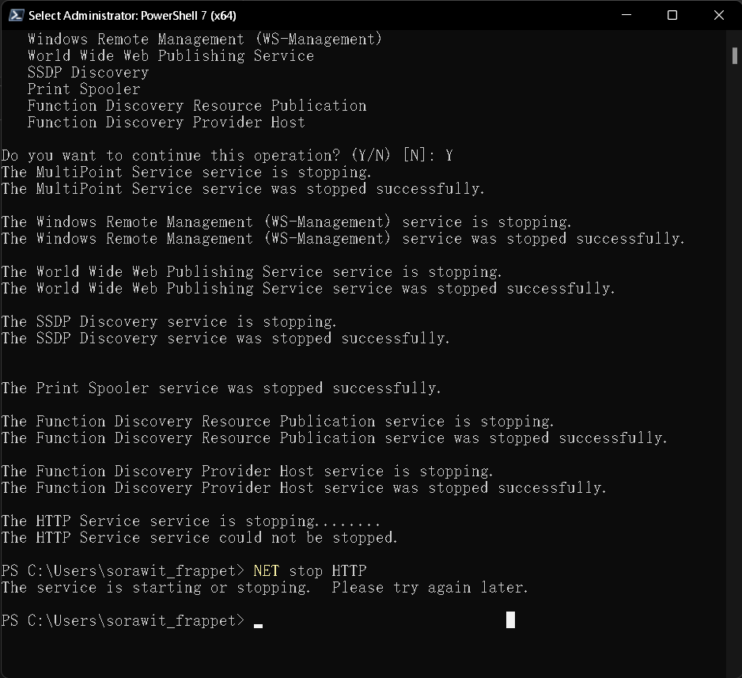

# Micro service development
[](https://youtu.be/-zfABqdhmPg "การพัฒนา Microservice แบบเป็นทีม")

รูปแบบการพัฒนา Micro service แบบเป็นทีม ผมวางโครงสร้างง่ายๆ 
สำหรับการศึกษา ถ้ามีการปรับปรุงก็จะมาอัปเดตข้อมูลในหน้านี้ให้ครับ 
- แสดงการพัฒนาแบบผสมผสาน หลาย Framework ร่วมกัน ตัวอย่างเป็น Vue, .NET และ SvelteKit ปรับใช้กับ Framework อื่นก็ได้
- ใช้ API Gateway(Traefik) รวม Microservice เข้าด้วยกัน คอนฟิกเปลี่ยนแบบไดนามิก ไม่ติด CORS ไม่ต้องแก้ path สำหรับ development/test/production 
- สามารถรันทั้งหมดในเครื่องเดียวกัน หรือจะคอนฟิกให้ข้ามเครื่องก็ได้ 
- แบ่งทีมแยกพัฒนา ถอดเปลี่ยน ทดสอบเป็นส่วนๆได้ หรือ ย้าย/ปิดบางบริการได้ เพื่อลดโหลดการทำงานได้
- โครงสร้างไม่ซับซ้อนเอาไปพัฒนาต่อได้ 
- ทำเป็น container ปรับคอนฟิกก็สามารถใช้กับ Test/Production ใช้บน K8s ได้เลย
- ทำตัวอย่างจำลองการทำ Loadbalance อย่างง่ายๆ ด้วยความสามารถของ docker และ traefik
- เพื่อให้เข้าใจพื้นฐานจะไม่ได้ใช้ Script หรือเครื่องมือที่ซับซ้อน จะหาโอกาสทำวีดีโอ แสดงการทำ CI/CD และ deploy ขึ้น K8s ในโอกาสต่อไป 
- ตัดส่วนของ Single Sign On และ Security ต่างๆออกเพื่อลดความซับซ้อน จะแยกเป็นวีโอเฉพาะหัวข้อนี้
- ถึงจะว่าแบบง่าย แต่ก็ลายตาหน่อย เพราะว่าประกอบจากหลายส่วนเข้าด้วยกัน แนะนำให้ค่อยๆดูจากคอนฟิกที่ทำไว้ให้ เอาไปปรับแก้ให้เหมาะกับการพัฒนาของเรา ถ้าวางโครงการพัฒนาเสร็จแล้วทุกคนจะทำงานได้รวดเร็วยิ่งขึ้นครับ 

# เตรียมตัวกันก่อน
- เคยพัฒนาโปรแกรม Backend/Frontend โดยใช้ Web API มาบ้าง ดูได้ใน [Channel ของผม](https://www.youtube.com/@schooltechx?sub_confirmation=1) ครับ
- ใช้วินโดว์หรือ Linux ที่ติดตั้ง Docker เรียบร้อยแล้ว รู้จักวิธีการใช้งาน docker compose เบื้องต้น [ดูได้จาก Play list นี้](https://www.youtube.com/watch?v=8g_GwM60MaU&list=PLWMbTFbTi55P6Vzv9a-un9oFZY-PwMj98)
- ถ้าอยากทำความเข้าใจ Trafik ให้มากขึ้นดูใน[วีดีโอนี้](https://www.youtube.com/watch?v=DgxRcFlccsU&list=PLWMbTFbTi55P6Vzv9a-un9oFZY-PwMj98&index=14&t=23s)ได้ครับ
- ถ้าจะใช้งานกับคนในทีมควรมี Docker Registry สำหรับใช้ภายใน จะได้ Pull/Push อิมเมจได้ไม่จำกัด ดูวิธีการทำได้[ที่นี้](https://www.youtube.com/watch?v=NJ5zcvvdL9o&list=PLWMbTFbTi55OtdeRGeerLFQSTw61cEGni&index=6)


# Install
แก้ไฟล์ hosts เป็นโดเมนที่ใช้งาน 
สร้างแต่ละโปรเจ็กให้เสร็จแล้วเอาโค้ดใน github ไปวางในโครงสร้างที่เหมาะสม
- tf.home.lan ใช้เข้า traefik Dashboard
- fe.com สำหรับทดสอบ
- fe.dev.com สำหรับนักพัฒนา

## API Gateway (Reverse Proxy) - Traefik(80)
เป็นช่องทางที่เข้าถึงทุกบริการ ทำการ route และ load balance ทุกโปรแกรมจะอยู่ในเน็ตเวิร์ก proxy เดียวกัน (docker network) สามารถอ้างชื่อ service ใน docker แทน DNS ได้
- docker-compose.yaml ใช้เรียกใช้งาน 
- traefik.yaml เป็นคอนฟิกหลัก ใช้ Docker Label กับ File
- route.yaml เป็นคอนฟิก File สำหรับนักพัฒนา
### Note
สำหรับวินโดว์พอร์ต 80 มักจะไม่ว่างใช้บริการอื่นอยู่ให้ปิดไปก่อน จะเปิดอีกครั้งตอน restart
``` 
NET stop HTTP
```

คำสั่งที่ใช้
``` bash
cd api-gateway
docker network create proxy
docker compose up -d
```
## Download Server - Nginx(8080)
ใช้ Nginx ทำเวปเซิร์ฟเวอร์แบบธรรมดา ตัวอย่างไว้ใช้เก็บไฟล์สำหรับดาว์นโหลด แสดงวิธีง่ายๆในการร่วมเข้าเป็นส่วนหนึ่งของ Microservice 

- docker-compose.yaml ใช้เรียกใช้งาน 
- ./file เป็นโฟลเดอร์สำหรับเก็บไฟล์ mount กับโฟลเดอร์ในเครื่อง host
``` bash
cd dl
docker compose up -d
```
## Frontend - Vue (8081)
ใช้เป็น Vue 3
- App.vue เป็นตัวอย่างหน้า Frontend เพื่อเรียกใช้ Backend API
- Dockerfile, .dockerignore, nginx.conf และ docker-compose.yaml ใช้สำหรับ build/run docker
``` bash
npm init vue@latest
# fe, typescript, no no no ...
cd fe
npm install
npx vite --port=8081 --host=0.0.0.0
```

## Backend 1 (8082)
ใช้ .NET minimal API
- Program.cs สร้า API หน้าตาแบบนี้ /api/be1-1, /api/be1-2
- launchSettings.json เซ็ค IP/Port ให้เหมาะสม
- Dockerfile, .dockerignore และ docker-compose.yaml ใช้สำหรับ build/run docker


``` bash
dotnet new webapi -minimal -o be1
cd be1
dotnet restore
dotnet run
```
## Backend 2 (8083)
ใช้ SvelteKit 
- +server.js จะทำ API หน้าตาแบบนี้ /api/[type]/[id]
- svelteconfig.js ใช้ node adapter เพื่อจะได้ทำงานบน docker
- Dockerfile, .dockerignore และ docker-compose.yaml ใช้สำหรับ build/run docker
``` bash
# Skeleton project, TypeScript syntax, no ,no,no
npm create svelte@latest be2
cd be2
npm install
npm i -D @sveltejs/adapter-node
npx vite --port=8083 --host=0.0.0.0
```
## อ่านเพิ่ม
- [Vue deploy Docker](https://cli.vuejs.org/guide/deployment.html#docker-nginx) 
- [SvelteKit Node Adapter](https://kit.svelte.dev/docs/adapter-node)
