# ทำการ Role base Authorization APIs ด้วย Keycloak และ .NET6

ตัวอย่างการทำใช้ Dotnet 6 Minimal API ที่จำกัดสิทธิ์ผ่าน Role ที่กำหนดไว้ใน Keycloak แนะนำให้ไปดูหัวข้อก่อนหน้า [JWT Authentication](https://github.com/schooltechx/youtube/blob/main/keycloak/api-jwt-auth/README.md) ห้วข้อนี้มีการเพิ่ม Authorization ด้วย Role เข้ามา

## Keycloak รันด้วย docker

ในตัวอย่างนี้จะแสดงการพัฒนาโปรแกรมทั้งหมดใน localhost สำหรับนักพัฒนา จะไม่ได้ใช้ https (ดู docker-compose.yml)

    docker run --name keycloak -p 8080:8080 -e KEYCLOAK_USER=<USERNAME> -e KEYCLOAK_PASSWORD=<PASSWORD> jboss/keycloak

## ตั้งค่า Keycloak

สร้าง Realm ชื่อ test  
สร้าง Client ใช้ค่าตั้งต้น
- Client-ID: js-console แล้วมี Root URL
- Root URL: http://localhost:28851 (ค่าพอร์ตจะเปลี่ยนอีกทีหลังรัน .NET)
- Access Type: public 

** ระวังคำว่า localhost ใน docker ให้ดีมันจะหมายถึงตัว container เอง กรณีนี้เราใช้งานผ่าน browser คำว่า localhost จะหมายถึงเครื่องโฮสต์ กรณีอ้างชื่อจาก service ใน docker-compose ควรใช้พอร์ตภายใน container ด้วย

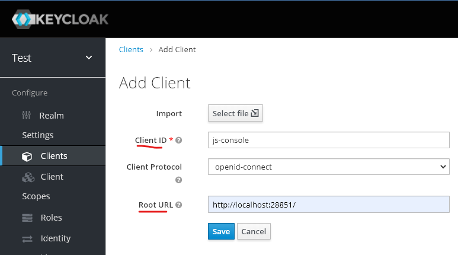

Roles จาก Realm กดปุ่ม "Add Role" เพิ่ม admin, dev
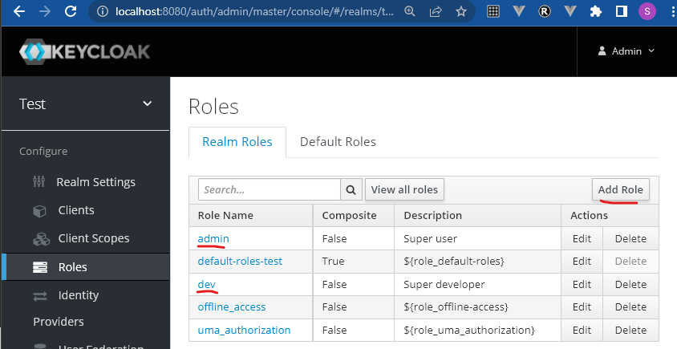

ตัวอย่าง Roles จาก Client กดปุ่ม "Add Role" เพิ่ม admin, dev
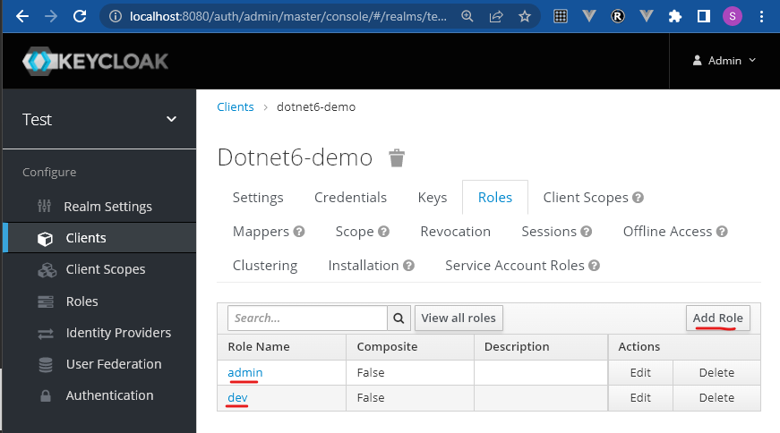

ดังนั้นการ Map Roles มาที่ Token Clame เลือกได้ว่าจะเอา Role จาก Realm หรือ Client ในตัวอย่างต่อไปทั้งหมดจะใช้จาก Roles ของ Realm  ให้สร้าง Mapper ใหม่ (เราสามารถแก้จาก mapper ตัวที่มีอยู่ก็ได้ ถ้าเข้าใจการทำงาน) .NET จะใช้ role(ไม่มี s)
ต้องทำการ Map Role ของ Keycloak ให้อยู่ในรูปแบบ .NET เข้าใจ เราสามารถใช้ Roles ของ Realm หรือ Client ก็ได้ ในภาพ admin มันจะเป็น realm_access:roles:admin จะถูกเอามาอยู่ตื้นขึ้นเป็นรูปแบบที่ .NET ใช้ใน Token role:admin  

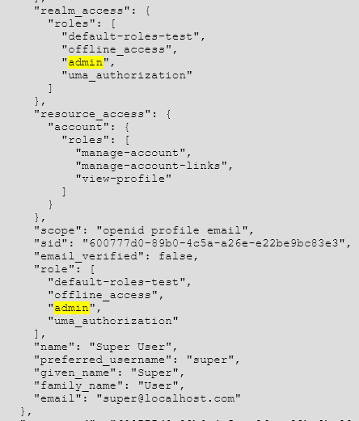  

Client Scopes/roles/Mappers แล้วกดปุ่ม Create  
- Name: root roles(ชื่ออะไรก็ได้)
- Mapper Type: User Realm Role (หรือ User Client Role)
- Token Clame Name: role

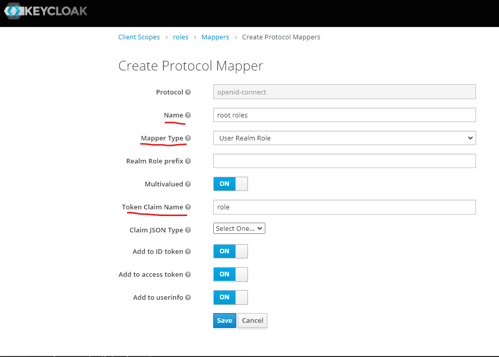

สร้างยูสเซอร์ super และ developer สำหรับทดสอบ 
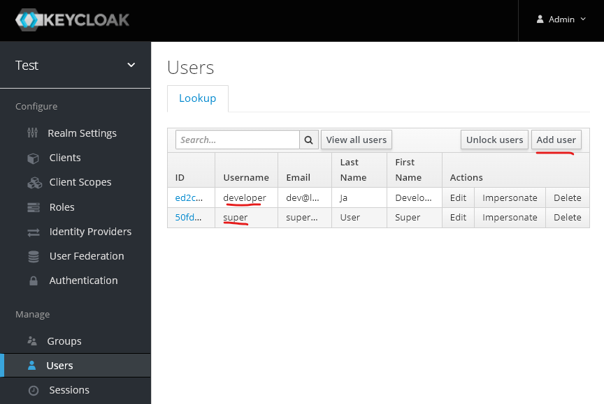

กำหนด Role 
- super เป็น admin
- developer เป็น dev

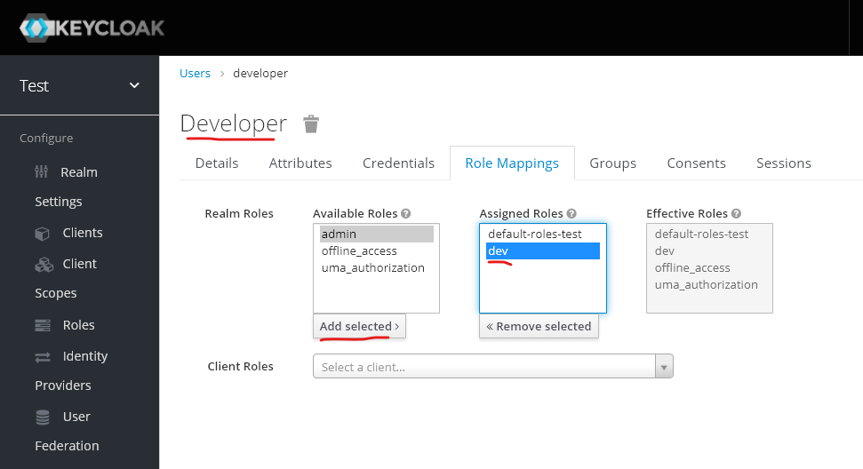

## .NET6 

แนะนำให้ใช้ VS Studion 2022 สร้าง
- Template web API,แบบ minimal api, ไม่ใช้ https , Docker Support
- สร้างโฟลเดอร์ wwwroot
- เพิ่ม package Microsoft.AspNetCore.Authentication.JwtBearer 

หรือ dotnet new (จะต้องตั้งค่าเองอีกหลายอย่าง ไม่แนะนำ) 

    dotnet --version
    6.0.202
    dotnet new webapi -minimal -o webapi-keycloak
    cd .\webapi-keycloak\
    mkdir wwwroot
    dotnet add package Microsoft.AspNetCore.Authentication.JwtBearer  
    dotnet restore
    code .

## ไฟล์  appsetting.json

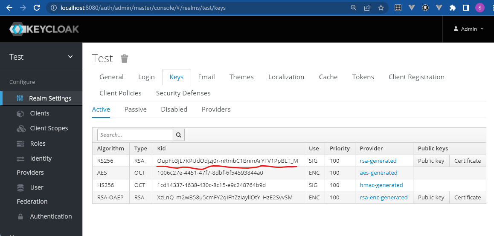

เอาค่า Realm Key ไปใส่ใน appsetting.json

    {
    "Jwt": {
        "Key": "OupFb3jL7KPUdOdjzj0r-nRmbC1BnmArYTV1PpBLT_M",
        "Issuer": "http://localhost:8080/auth/realms/test"
    },
    "Logging": {
        "LogLevel": {
        "Default": "Information",
        "Microsoft.AspNetCore": "Warning"
        }
    },
    "AllowedHosts": "*"
    }

## ไฟล์ Proram.cs

- เปิดใช้ Authentication/Authorization
- เปิดใช้ Health Checks
- Swagger แบบมี JWT Athentication
- ทำเป็น webserver  (UseStaticFiles)
- ใช้ minimal API แบบมี Authorize  

        using Microsoft.AspNetCore.Authentication.JwtBearer;
        using Microsoft.AspNetCore.Authorization;
        using Microsoft.IdentityModel.Tokens;
        using Microsoft.OpenApi.Models;
        using System.Text;

        var builder = WebApplication.CreateBuilder(args);
        var issuer = builder.Configuration["Jwt:Issuer"];
        var key = builder.Configuration["Jwt:Key"];
        builder.Services.AddAuthentication(JwtBearerDefaults.AuthenticationScheme).AddJwtBearer(opt =>
        {
            opt.RequireHttpsMetadata = false;//false for dev
            opt.Authority = issuer;
            opt.TokenValidationParameters = new()
            {
                ValidateIssuer = true,
                ValidateAudience = false,
                ValidateLifetime = true,
                ValidateIssuerSigningKey = true,
                ValidIssuer = issuer,
                IssuerSigningKey = new SymmetricSecurityKey(Encoding.UTF8.GetBytes(key))
            };
        });
        builder.Services.AddAuthorization();
        builder.Services.AddEndpointsApiExplorer();
        builder.Services.AddSwaggerGen(option =>
        {
            option.SwaggerDoc("v1", new OpenApiInfo { Title = "Demo API", Version = "v1" });
            option.AddSecurityDefinition("Bearer", new OpenApiSecurityScheme
            {
                In = ParameterLocation.Header,
                Description = "Please enter a valid token",
                Name = "Authorization",
                Type = SecuritySchemeType.Http,
                BearerFormat = "JWT",
                Scheme = "Bearer"
            });
            option.AddSecurityRequirement(new OpenApiSecurityRequirement
            {
                {
                    new OpenApiSecurityScheme
                    {
                        Reference = new OpenApiReference
                        {
                            Type=ReferenceType.SecurityScheme,
                            Id="Bearer"
                        }
                    },
                    new string[]{}
                }
            });
        });

        builder.Services.AddHealthChecks();
        var app = builder.Build();
        app.UseAuthentication();
        app.UseAuthorization();
        app.UseDefaultFiles();
        app.UseStaticFiles();

        if (app.Environment.IsDevelopment())
        {
            app.UseSwagger();
            app.UseSwaggerUI();
        }

        app.MapHealthChecks("/health");
        app.MapGet("/hello", () => "Hello");
        app.MapGet("/auth", (HttpContext context) => {
            var id = context.User.FindFirst(ClaimTypes.NameIdentifier)?.Value;
            var n = context.User.FindFirst(ClaimTypes.Name)?.Value;
            var g = context.User.FindFirst(ClaimTypes.GivenName)?.Value;
            var sn = context.User.FindFirst(ClaimTypes.Surname)?.Value;
            var p = context.User.FindFirst("preferred_username")?.Value;
            return $"{id}:{n}:{sn}:{p}";
        }).RequireAuthorization();
        
        app.MapGet("/admin", [Authorize(Roles = "admin")] () => "Admin ");
        app.MapGet("/admin_dev", [Authorize(Roles = "admin,dev")] () => "Dev or Admin");
        app.MapGet("/dev", [Authorize(Roles = "dev")] () => "Dev ");
        app.Run();

## Frontend Authentication 
 
- เอา index.html กับ keycloak.json จาก [js-console](https://github.com/keycloak/keycloak/tree/main/examples/js-console/src/main/webapp) ใส่ในโฟลเดอร์ wwwroot ของ .NET
- index.html แก้ path ของ keycloak.js ให้ถูกเช่น http://localhost:8080/auth/js/keycloak.js
- keycloak.json ให้ "auth-server-url" : "http://localhost:8080/auth" 
- รันโปรแกรม .NET แนะนำให้ใช้แบบ IIS Express ถ้าใช้  Docker ตั้งแก้เป็น IP Address เพราะ localhost ใน container มันเป็นคนละตัวกับ localhost เครื่องโฮส ซึ่งต้องใช้ IP Address แทน
- http://localhost:28851/swagger/index.html เปิดไว้เพื่อทดสอบ API 
- เข้าหน้า http://localhost:28851/ กดปุ่ม Login จะทำการ redirect ไปหน้า login ของ Keycloak ใช้ยูสเซอร์ super
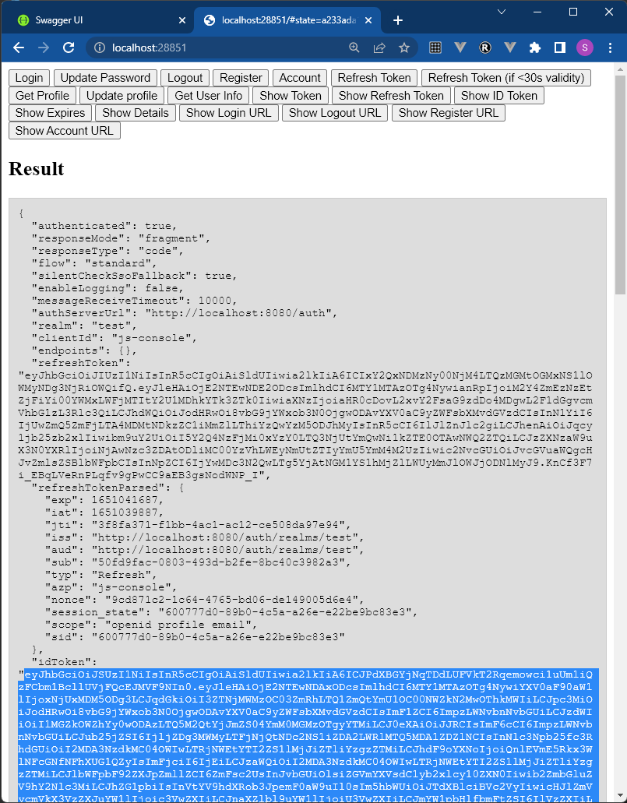
- เอา ID Token ที่ได้หลัง login มาใส่ใน Swagger เพื่อทำการทดสอบ API หรือทำผ่าน Postman ก็ได้
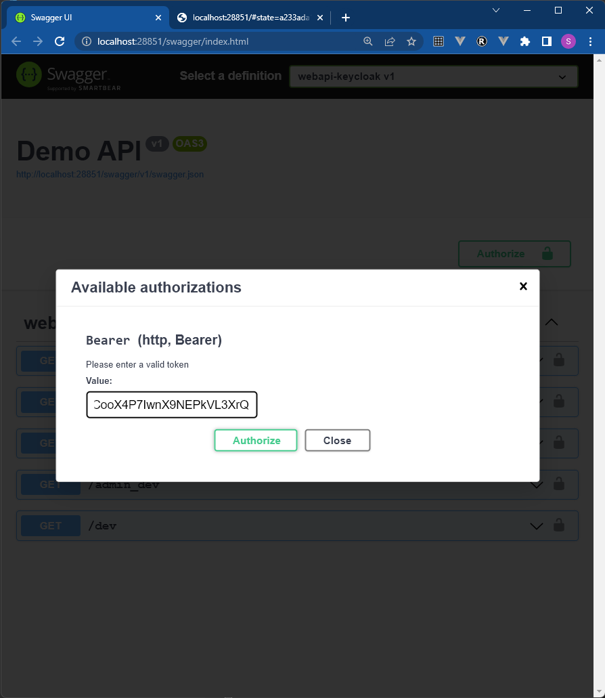
- ทดสอบ API ด้วย Token ของยูสเซอร์ super
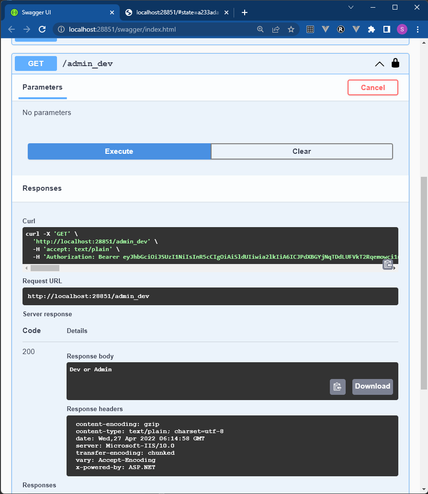
- เปลี่ยนเป็น developer แล้วทำการทดสอบ API อีกรอบเทียบกัน 
- 401 Unauthorized แสดงว่าไม่ได้แนบ Token
- 403 Forbidden เพราะ Role นั้นไม่มีสิทธ์เข้าถึง API ที่กำหนด

## API ที่ใช้งาน
- /helth ไว้ตรวจสอบว่า API ใช้งานได้อยู่
- /hello ไม่มีการ Authentication
- /auth ต้อง Authentication ก่อนใช้
- /admin ต้องมี role เป็น admin
- /admin_dev ต้องมี role เป็น admin หรือ dev
- /dev ต้องมี role เป็น dev

## Dockerfile: docker build --rm -t dotnetapi:latest .

    FROM mcr.microsoft.com/dotnet/aspnet:6.0 AS base
    WORKDIR /app
    EXPOSE 80

    FROM mcr.microsoft.com/dotnet/sdk:6.0 AS build
    WORKDIR /src
    COPY ["webapi-keycloak.csproj", "."]
    RUN dotnet restore "./webapi-keycloak.csproj"
    COPY . .
    WORKDIR "/src/."
    RUN dotnet build "webapi-keycloak.csproj" -c Release -o /app/build

    FROM build AS publish
    RUN dotnet publish "webapi-keycloak.csproj" -c Release -o /app/publish

    FROM base AS final
    WORKDIR /app
    COPY --from=publish /app/publish .
    ENTRYPOINT ["dotnet", "webapi-keycloak.dll"]

## การรับบน Docker

TBD

## อ่านเพิ่มเติม

- <https://docs.microsoft.com/en-us/aspnet/core/fundamentals/minimal-apis?view=aspnetcore-6.0>
- <https://stackoverflow.com/questions/56327794/role-based-authorization-using-keycloak-and-net-core>
- <https://medium.com/@xavier.hahn/adding-authorization-to-asp-net-core-app-using-keycloak-c6c96ee0e655>
- <https://docs.microsoft.com/en-us/aspnet/core/fundamentals/minimal-apis?view=aspnetcore-6.0#special-types>
