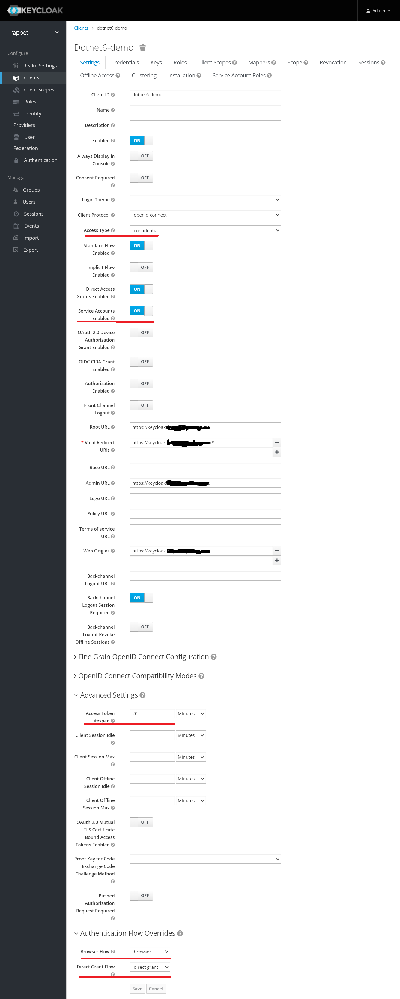
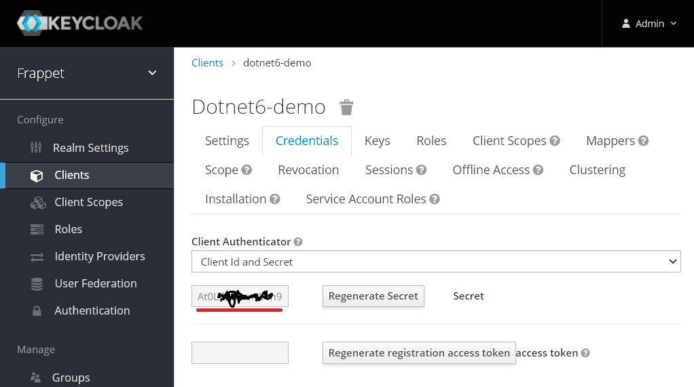
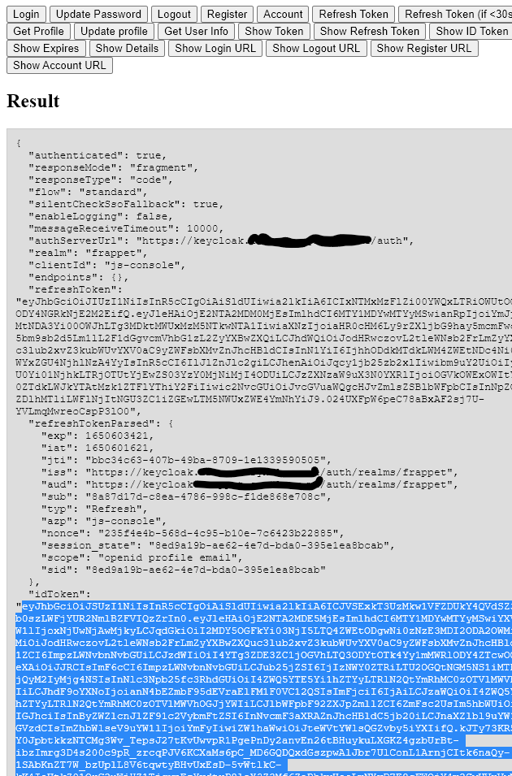

# ทำการ JWT Authentication APIs ด้วย Keycloak

ตัวอย่างการทำใช้ Dotnet 6 Minimal สร้าง Web API เพื่อทำการ Authentication กับ Keycloak 
มีประโยชน์ในการทำ Single Sign On (SSO) ระหว่าง Frontend กับ Backend หรือระหว่าง Backend ด้วยกัน
ทำให้แยก Microservice ได้ง่ายแบ่งเป็นสองกรณี

## กรณี 1 ใช้ แชร์ secret 

จะมี secret ที่รู้กันระหว่าง keycloak และ ผู้ที่จะใช้ API  
เมื่อทำ Authentication กับ Keycloak ด้วย secret จะได้ Access key กลับมา ให้เอาไปแนบตอนเรียก API
วิธีนี้เหมาะกับการคุยกันระหว่าง Microservice ตัวอย่างนี้เอามาจาก  

<https://www.mshowto.org/keycloak-server-ile-apilariniza-jwt-validasyonu-nasil-ekleyebilirsiniz-bolum-1.html>  

<https://www.mshowto.org/keycloak-server-ile-apilariniza-jwt-validasyonu-nasil-ekleyebilirsiniz-bolum-2.html>

### วิธีตั้งค่า

- สร้าง realm (ตัวอย่างชื่อ frappet) ใน Realm Setting เก็บค่า RS256 kid ไว้ เป็น Public key ที่จะใช้ Verify token ใน appsetting.json

 

- สร้าง client ชื่อ dotnet6-demo โดยมี root url เป็น https://keycloak.xxx.com 
- เซ็ตค่าดังนี้  
Access Type : confidential  
Service Account Enabled : On  
Access Token Lifespan : 20  
Browser Flow: borwser
Direct Grant Flow : direct grant 

- ในแทป Credentials  ก็อปค่า Secret เก็บไว้ (ถ้ายังไม่มี หรือต้องการเปลี่ยนให้กดปุ่มเพื่อสร้างใหม่)

## กรณี 2 Frontend ทำ Authentication ด้วย User/Password 

กรณีนี้เราสามารถใช้ JavaScript Framework(Vue,React,Svelte) สร้างฟอร์มรับ ชื่อยูสซอร์ และรหัสผ่าน เพื่อ authen กับ keycloak client เก็บ token ใน storage ควรใช้ keycloak-js ในการทำเพราะจะจัดการ refresh token, cookie ให้ด้วย  
- Realm frappet สร้าง keycloak client ชื่อ js-console 

## สร้าง API .NET

สร้าง dotnet 6 minimal apiใช้โค้ดและเก็บ Public Key ใน appsetting.json ตามโค้ดด้านล่าง แล้วรันบน localhost ก็ได้

### คำสั่ง

    dotnet --version
    6.0.202
    dotnet new webapi -minimal -o dotnet6-demo
    cd .\dotnet6-demo\
    dotnet add package Microsoft.AspNetCore.Authentication.JwtBearer  
    dotnet restore
    code .

### ไฟล์ appsetting.json

    {
    "Jwt": {    
        "Key": "UHLdOu32L5TVCRF8AWRgu220joK3-acaDv6iAdUHC6k",    
        "Issuer": "https://keycloak.xxx.com/auth/realms/frappet"    
    },      
    "Logging": {
        "LogLevel": {
        "Default": "Information",
        "Microsoft.AspNetCore": "Warning"
        }
    },
    "AllowedHosts": "*"
    }

### ไฟล์ Proram.cs

    using Microsoft.AspNetCore.Authentication.JwtBearer;
    using Microsoft.IdentityModel.Tokens;
    using System.Text;
    var builder = WebApplication.CreateBuilder(args);
    var issuer = builder.Configuration["Jwt:Issuer"];
    builder.Services.AddAuthentication(JwtBearerDefaults.AuthenticationScheme).AddJwtBearer(opt =>
    {
        opt.RequireHttpsMetadata = true;
        opt.Authority = issuer;
        opt.TokenValidationParameters = new()
        {
            ValidateIssuer = true,
            ValidateAudience = false,
            ValidateLifetime = true,
            ValidateIssuerSigningKey = true,
            ValidIssuer = issuer,
            IssuerSigningKey = new SymmetricSecurityKey(Encoding.UTF8.GetBytes(builder.Configuration["Jwt:Key"]))
        };
    });
    builder.Services.AddAuthorization();
    var app = builder.Build();
    app.UseAuthentication();
    app.UseAuthorization();

    app.MapGet("/", () => "Hello World!").RequireAuthorization();
    app.Run();

## Authentication กรณี 1 (share secret)

- POST โดยแนบ Sercret ตามภาพจะได้ access_token

- เอา Access Token ไปใช้เรียกใช้ API 

## Frontend Authentication สำหรับกรณี 2 (User loin)
ถ้าใช้ keycloak เป็น public url ตัว frontend ก็ต้อง public ด้วย เวลา login จะ redirect ไป Keycloak และ redirect กลับมาที่ frontend ตอนพัฒนาอาจจะใช้ ngrok หรือไม่ก็ตั้ง keycloak ที่ localhost ในตัวอย่างจะตั้ง frontend เป็น public 
- ตั้ง webserver ด้วย nginx ใช้โต้ดตัวอย่าง [js-console](https://github.com/keycloak/keycloak/tree/main/examples/js-console/src/main/webapp) ไปใส่ไว้ใน wwwroot

- แก้ keycloak.json ให้ถูกต้อง

        {
        "realm" : "frappet",
        "auth-server-url" : "https://keycloak.xxx.com/auth",
        "ssl-required" : "external",
        "resource" : "js-console",
        "public-client" : true
        }

- เข้าหน้า https://keycloak-js-console.xxx.com/ จะทำการ redirect ไปหน้า login

- เอา Token ที่ได้หลัง login มาใส่ใน Postman เพื่อเรียก API ได้เหมือนกรณี 1

JavaScript Frontend ควรใช้ [keycloak-js](https://github.com/keycloak/keycloak-documentation/blob/main/securing_apps/topics/oidc/javascript-adapter.adoc) จัดการจะทำให้ง่ายและปลอดภัยกว่า ดูโค้ดของ [js-console](https://github.com/keycloak/keycloak/tree/main/examples/js-console/src/main/webapp) เป็นตัวอย่างได้

## Note

### ข้อมูลของ Realm

จะอยู่ในลิงค์นี้
<https://keycloak.xxx.com/auth/realms/frappet/.well-known/openid-configuration>

### Endpoint

- /protocol/openid-connect/auth  
- /protocol/openid-connect/token  
- /protocol/openid-connect/userinfo

### Mobile

กรณี mobile มันจะ redirect กลับมาที่ App  ยังไม่ได้ทดสอบ แต่น่าจะทำเหมือนกรณี 2 
มีตัวอย่างของ Flutter ที่ยังไม่ได้ลองเหมือนจะใช้ Flow คนละแบบ  
<https://iabhishek3.medium.com/keycloak-integration-flutter-7af4088ff7a>

### อ่านเพิ่มเติม

- [Vue with keycloak](https://medium.com/keycloak/secure-vue-js-app-with-keycloak-94814181e344)
- [การใช้งาน Keycloak เบื้องต้น](https://dev.to/mossnana/keycloak-2kl6)  
- [Integrating OpenID Connect to your application stack (Asp.Net Core, Angular)](https://dev.to/kayesislam/integrating-openid-connect-to-your-application-stack-25ch)
- [ASP.Net Core & Angular OpenID Connect using Keycloak](https://medium.com/@xavier.hahn/asp-net-core-angular-openid-connect-using-keycloak-6437948c008)
- [Keycloak and Express](https://medium.com/keycloak/keycloak-and-express-7c71693d507a)

