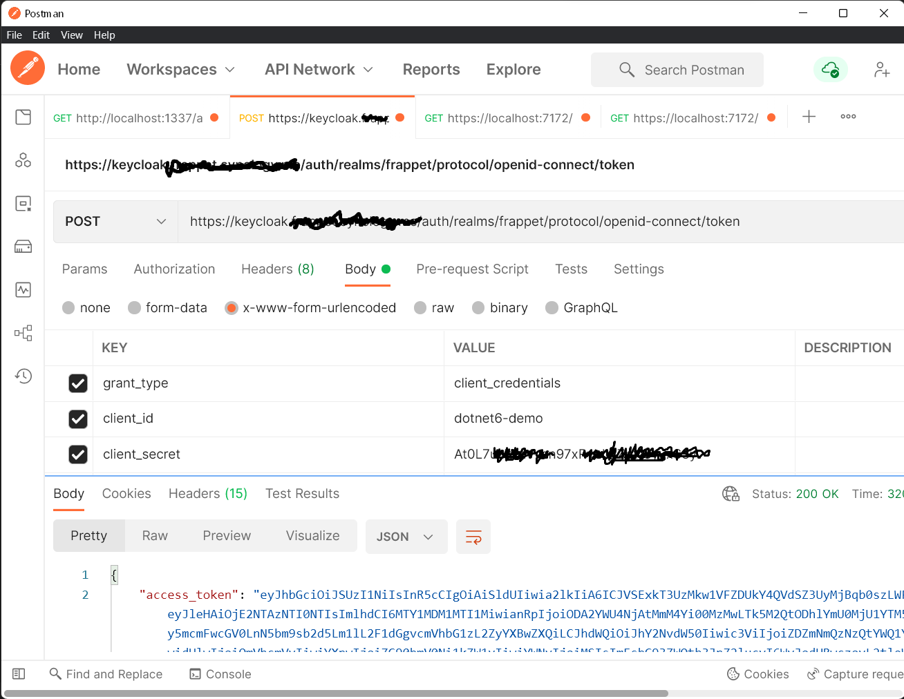
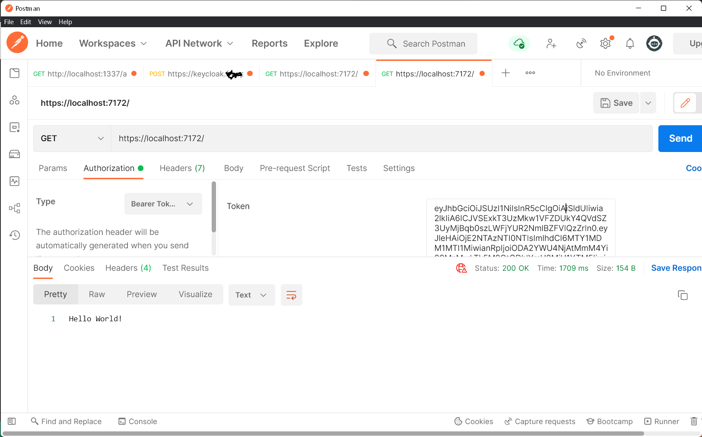

# Add JWT Validation to Your APIs with Keycloak Server

ตัวอย่างการทำใช้ Dotnet 6 Minimal API เพื่อทำการ Authentication ด้วย Keycloak แบบใช้ Secret ทำการ Authentication เพื่อรับ access token แล้วเอาไปใช้เรียกผ่าน API อีกที แบบนี้ไม่ได้ใช้ User/password เหมาะกับการคุยกันระหว่าง Server   
แปลมาจาก  
<https://www.mshowto.org/keycloak-server-ile-apilariniza-jwt-validasyonu-nasil-ekleyebilirsiniz-bolum-1.html>  

<https://www.mshowto.org/keycloak-server-ile-apilariniza-jwt-validasyonu-nasil-ekleyebilirsiniz-bolum-2.html>

## keyclock 

- สร้าง realm ชื่อ frappet ใน Realm Setting เก็บค่า RS256 kid เก็บไว้ (Public Key)

 

- สร้าง client ชื่อ dotnet6-demo โดยมี root url เป็น https://keycloak.xxx.xxx 
- เซ็ตค่าดังนี้  
Access Type : confidential  
Service Account Enabled : On  
Access Token Lifespan : 20  
Browser Flow: borwser  
Direct Grant Flow : direct grant  

- ในแทป Credentials  ก็อปค่า Secret เก็บไว้

## dotnet 6 command
    dotnet --version
    6.0.202
    dotnet new web -o dotnet6-demo
    cd .\dotnet6-demo\
    dotnet restore
    dotnet add package Microsoft.AspNetCore.Authentication.JwtBearer --version 6.0.4
    code .

## appsetting.json (Key เป็น Public Key จาก Realm)

    {
    "Jwt": {    
        "Key": "UHLdOu32L5TVCRF8AWRgu220joK3-acaDv6iAdUHC6k",    
        "Issuer": "https://keycloak.xxx.xxx/auth/realms/frappet"    
    },      
    "Logging": {
        "LogLevel": {
        "Default": "Information",
        "Microsoft.AspNetCore": "Warning"
        }
    },
    "AllowedHosts": "*"
    }

## Proram.cs

    using Microsoft.AspNetCore.Authentication.JwtBearer;
    using Microsoft.IdentityModel.Tokens;
    using System.Text;
    var builder = WebApplication.CreateBuilder(args);
    var issuer = builder.Configuration["Jwt:Issuer"];
    builder.Services.AddAuthentication(JwtBearerDefaults.AuthenticationScheme).AddJwtBearer(opt =>
    {
        opt.RequireHttpsMetadata = true;
        opt.Authority = issuer;
        opt.TokenValidationParameters = new()
        {
            ValidateIssuer = true,
            ValidateAudience = false,
            ValidateLifetime = true,
            ValidateIssuerSigningKey = true,
            ValidIssuer = issuer,
            IssuerSigningKey = new SymmetricSecurityKey(Encoding.UTF8.GetBytes(builder.Configuration["Jwt:Key"]))
        };
    });
    builder.Services.AddAuthorization();
    var app = builder.Build();
    app.UseAuthentication();
    app.UseAuthorization();

    app.MapGet("/", () => "Hello World!").RequireAuthorization();
    app.Run();

## Postman

- POST ทำการ Authen ด้วย Sercret (จาก client)จะได้ access token มา

- เอา Access Token ไปใช้เรียกใช้ API ที่ต้องการ Authen

