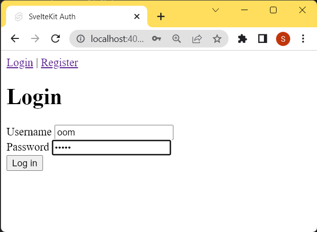
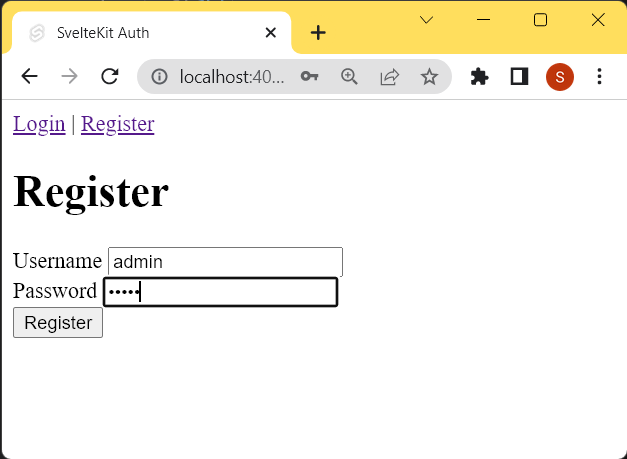
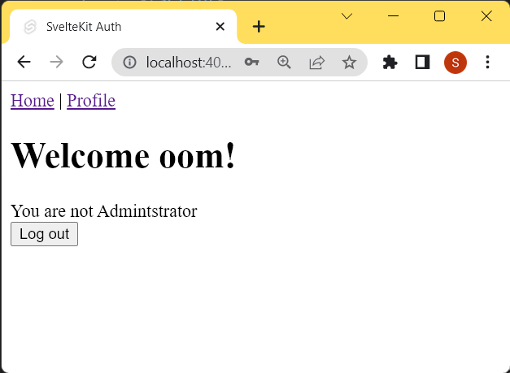
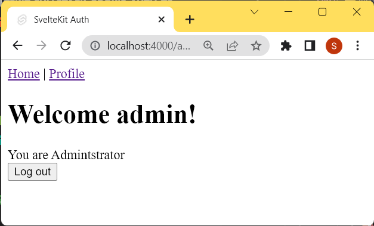

# SvelteKit Create cookies Authentication

Dear English developer. I modify from [this document](https://joyofcode.xyz/sveltekit-authentication-using-cookies) for Thai developer. Below content was written in Thai. The modifyed source code have 2 version, [JavaScript](js/) and [TypeScript](ts/) 

เรียนรู้การสร้างระบบ login ด้วยตัวเองโดยใช้ cookies เมื่อเข้าใจการทำงานแล้ว ก็จะเข้าใจการ authentication แบบอื่นๆได้ง่ายขึ้น

## ตัวอย่างหน้าจอ






## ลักษณะโปรแกรม
- เวปแอป มีฟอร์ม login เก็บ session เป็น cookies ไม่มี javascript ก็ทำงานได้
- ระบบมีฟังก์ชั้น register, login,logout, profile, protect page, ตรวจสอบสิทธ์จาก roles ได้  
- โค้ดเพื่อเรียนรู้พื้นฐานเรื่องระบบ Authentication แต่ก็ค่อนข้างปลอดภัย บน production ต้องใช้คู่กับ HTTPS (NODE_ENV === 'production')
- cookies เป็นแบบ sameSite, httpOnly ตัว JavaScript อ่านไม่ได้ ปลอดภัยกว่า Session Storage.
- มีการ hash รหัสผ่านก่อนเก็บลงฐานข้อมูล ไม่สามารถแกะออกมาดูได้
- token เป็นการ สุ่มขึ้นมา สามารถเดาไปเรื่อยๆเพื่อหา token ได้แต่ใช้เวลานานเพราะค่อนข้างยาว อาจจะเพิ่มการตรวจสอบการใช้ token ผิดซ้ำๆ หรือทำให้ token หมดอายุเร็วขึ้นก็จะปลอดภัยขึ้น
- ตัวอย่างไม่ได้กันการเดารหัสผ่านซ้ำๆ ถ้าไปใช้จริงน่าจะเพิ่มตรงนี้ด้วย
- มีการตรวจสอบฐานข้อมูลทุกครั้งที่มีการ request ถ้าใช้งานหนักๆ ควรมี cache session ของยูสเซอร์ไว้ด้วย 
- ผมมีโค้ดให้สองแบบคือ  [JavaScript](js/) และ [TypeScript](ts/)
- ยังไม่ได้เพิ่ม enhance เข้าไป

## Install
- ให้ติดตั้ง node.js รุ่นล่าสุด
- สร้างโปรเจ็ก SvelteKit โค้ดตัวอย่างที่มีให้จะมีแบบ TypeScript กับ JSDoc ตอนสร้างโปรเจ็กแล้วเลือกมาให้ถูกนะ
- ติดตั้ง modules ที่จำเป็น bcrypt, prisma
- bcrypt ใช้ hash รหัสผ่าน ทำให้ย้อนรอยแกะรหัสผ่านในฐานข้อมูลออกมาดูไม่ได้
- prisma ORM ติดต่อฐานข้อมูล SQLite, ให้แก้ prisma.schema เพื่อให้มีตาราง User, Roles
- คำสั่ง db push เพื่อสร้างตารางรางตาม schema 
- เรียก studio เป็นเครื่องมือจัดการฐานข้อมูลอย่างง่าย ให้เพิ่ม USER และ ADMIN ในโมเดล Roles
- ทำตามวีดีโอ ก็อปโค้ดให้ถูกตำแหน่ง แล้วแต่ว่าตอนสร้างโปรเจ็กเป็น TypeScript หรือ ๋JavaScript  เลือกโฟลเดอร์ [js](js/) หรือ [ts](ts/) 
ให้ก็อปโฟลเดอร์ที่อยู่กับเอกสารนี้ .svelte-kit/tsconfig.json, src/*, prisma/scheme.prisma  ไปใส่ในโปรเจ็กที่สร้างก็จะใช้งานได้


``` sh
# create svelte project with TypeScript or JSDoc support
npm create svelte@latest sveltekit-fullstack-cookie-auth
cd sveltekit-fullstack-cookie-auth
npm install
npm install bcrypt
npm install -D @types/bcrypt
npm install prisma --save-dev
npx prisma init --datasource-provider sqlite
code .
## modify prisma.schema add model User,Roles
npx prisma db push
npx prisma studio
# add roles USER and ADMIN
```

## Pages
การทำงานของหน้าต่างๆ
### Register (auth/register/)
- เข้าหน้านี้ได้ถ้าไม่ได้ login อยู่
- ตรวจสอบความถูกต้อง ยูสเซอร์ต้องไม่มีในฐานข้อมูล
- สร้างยูสเซอร์ในฐานข้อมูล รหัสผ่าน hash ด้วย bcrypt, role USER
- โยนไปหน้า /auth/login
### Login (auth/login/)
- เข้าหน้านี้ได้ถ้าไม่ได้ login อยู่
- ตรวจความถูกต้องของข้อมูล
- ตรวจสอบยูสเซอร์มีหรือไม่
- ตรวจสอบรหัสว่าถูกหรือไม่
- อัปเดต userAuthToken ใหม่
- สร้าง session (cookies)
- โยนไปหน้า Home

### Logout (auth/logout/)
- เคลียค่า session (cookies) GET จะเปลี่ยนหน้าฝั่ง client ใช้ POST เพราะว่า จะให้มัน reload หน้าใหม่ ไม่งั้น layout ไม่เปลี่ยน

### Profile
- ต้อง login ก่อนถึงเข้าได้
- ตรวบสอบได้ว่าเป็น ADMIN หรือไม่


## รายละเอียดไฟล์ และหัวข้ออื่นๆ
## .svelte-kit/tsconfig.json
ถ้า "paths" ไม่อ้างถึง $lib ให้เพิ่มเข้าไปเหมือนข้างล่าง

``` js
{
	"compilerOptions": {
		"baseUrl": "..",
		"paths": {
			"$lib": [
				"src/lib"
			],
			"$lib/*": [
				"src/lib/*"
			]
		},
        ...
    }
    ...
}
```

### cookies
ค่า userAuthToken ที่สุ่มขึ้นมาของการ login ครั้งนี้จะเก็บไว้ใน session การ logout ก็แค่ล้างค่านี้ออกไป

### src/hook.server.ts
hook จะทำงานทุกครั้งเมื่อมี request ไปที่เซิร์ฟเวอร์ ทำให้เราสามารถเปลี่ยน request ที่เข้ามา หรือทำการ response ตามที่ต้องการได้ 
- ตรวจสอบ cookies ที่มีชื่อ session ถ้าไม่มีก็ส่งต่อ resolve()
- หายูสเซอร์ในฐานข้อมูล ที่มีค่า token ตรงกับใน session 
- ถ้าพบเซ็ตค่า event.locals.user ให้เพื่อจะใช้ใน load() ของแต่ละหน้า
- ส่งต่อให้ทำการโหลดหน้าแบบปกติ resolve()

สังเกตจะมีการอ่านฐานข้อมูลเพื่อตรวยสอบทุกครั้งเมื่อมีการ request เพื่อเพิ่มประสิทธิ์ภาพอาจจำเป็นต้องเก็บข้อมูลในหน่วยความจำแทน แต่ถ้าเป็นการเปลี่ยนหน้าของ single page อาจจะไม่มีการ render หน้าใหม่

### event.locals
จะใช้ส่งค่าออปเจ็ก user จาก hook ใช้ฝั่งเซิร์ฟเวอร์ เรียกได้จาก load() 
จะตรวจสอบสิทธิ์ของผู้ใช้งาน ปกป้องข้อมูล และ redirect ไปหน้าที่เหมาะสม 

### $page.data
ใช้เพื่อโหลดช้อมูล user ฝั่ง client จะได้แสดงผลของหน้าตามการ login และ role

