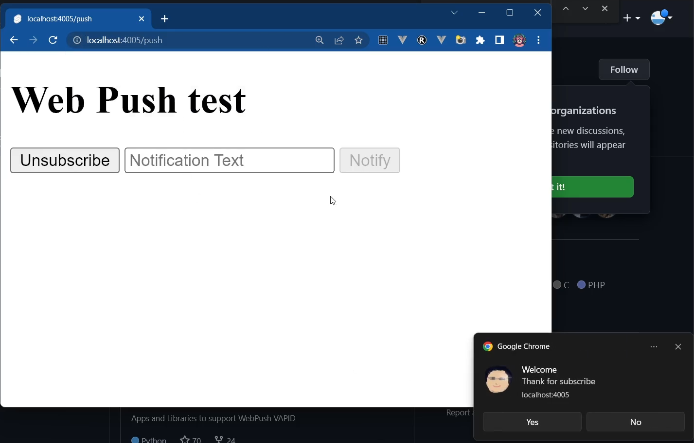

# Web Push

  หรือบางทีเรียก Push notification ทำให้เวปแอปสามารถส่งการแจ้งเตือนให้ผู้ใช้ เมื่อใดก็ได้โดยที่เวปนั้นปิดอยู่ก็ได้(Browser เปิดอยู่) 
  จะไปปรากฎที่การแจ้งเตือนของระบบปฎิบัติการ ตำแหน่งการแสดงการแจ้งเตือนขึ้นขึ้นกับระบบปฎิบัติการ 
  Push notification เป็นบริการฟรี เซิร์ฟเวอร์สำหรับการส่งข้อความรับผิดชอบโดยผู้ผลิด Browser แต่ละเจ้า 
  แต่การเขียนโปรแกรมเป็นมาตรฐานเดียวกัน ยกระดับให้ส่งแจ้งเตือนได้เหมือน mobile app และมักใช้ในการทำ 
  Progressive Web App (PWA) การทำงานเบื้องหลังจะใช้ Service Worker ช่วย การทำงานคล้ายกับ 
  [Web Worker](../web-worker/) แต่จะเฉพาะทางมากกว่า ใช้ใน PWA เป็นหลัก 
  เอกสารในเวปค่อนข้างเข้าใจยากหวังว่าตัวอย่างโค้ดและวีดีโอจะทำให้เข้าใจการทำงานมากขึ้น 



วีดีโอเป็นต้วอย่างสำหรับการเรียน จริงๆแล้วค่า Subscription สำหรับการส่ง Nitification ให้แต่ละ client ควรเก็บในฐานข้อมูลของ Backend โค้ดเขียนด้วย SvelteKit ใช้ ES Module สามารถปรับไปใช้กับ JavaScript Framework อื่นๆได้ไม่ยากนัก การส่ง Notification จะขึ้นกับ Browser และเครื่อง ดังนั้นผู้ใช้งานหนึ่งคนจะมีการแสดง notification ซ้ำซ้อนในเครื่องเดียวกันได้ 

[](https://www.youtube.com/watch?v=y_FwlkxtrvA&list=PLWMbTFbTi55ODDrafKItIGpJZl8r3XpyT&index=15 "SvelteKit Full Stack Part-7- Web Push ")

## อัปเดตเพิ่มจากวีดีโอ
- โค้ดเดิมในวีดีโอตอน import web-push ถ้าไปใช้ '@sveltejs/adapter-node' มันมีปัญหา ผมแก้เป็นแบบนี้แทนครับ
import webpush from 'web-push'
- เพิ่ม PUT เพื่อเป็นตัวอย่างการสร้าง Public/Private Key ใหม่ ด้วยโค้ด
- Build และ Deploy แอปของเราด้วย docker

## ขั้นตอนการทำงาน
- ใช้ Library web-push ในการจัดการ Push Notification เพื่อลดขั้นตอนยุ่งยาก
- ใช้ web-push สร้าง Public/Private Key สำหรับแอปของเรา เพื่อการสื่อสารอย่างปลอดภัย
- Frontend ลงทะเบียน Service Worker 
- Frontend ได้ Public Key ไปใช้สมัครรับข้อความจากเซิร์ฟเวอร์ (Subscribe)
- เมื่อ Subscribe แล้วจะได้ลิงค์ ของ API (endpoint) เป็น API ที่ใช้ส่งข้อความมาหา frontend ซึ่งควรให้ส่งไปให้เซิร์ฟเวอร์เก็บไว้ในฐานข้อมูลเพื่อใช้ส่งข้อมูลในโอกาสต่อๆไป
- ในวีดีโอตัวอย่าง Frontend หลัง Subscribe เสร็จจะส่ง endpoint พร้อมข้อความ Welcome ให้ Backend เพื่อใช้ส่งข้อความ 
- ส่งข้อความจากฟอร์มก็จะต้องส่ง endpoint ไปทุกครั้ง เพราะในตัวอย่างไม่มีฐานข้อมูลในการเก็บ
- เซิร์ฟเวอร์เรียก webpush.sendNotification(sub,JSON.stringify(msg)) เพื่อส่ง msg ให้เซิร์ฟเวิร์กลางของ Browser นั้นๆ(Chrome, Firefox, Edge etc)
- เมื่อเซิร์ฟเวอร์ส่งข้อมูลไปทึ Browser จะทำให้เกิดอีเว้น push ที่ Service Worker เราจะได้ event object ที่มี data ข้อความอยู่
- เมื่อเรียก self.registration.showNotification(data.title,data.option) ก็จะเกิด Notification ที่ Notification Center ของระบบปฎิบัติการนั้นๆ 

## ติดตั้ง
- สร้างโปรเจ็ก SvelteKit ใช้ JSDoc และติดตั้ง web-push และสร้าง public/private key
```
npm install web-push -g
web-push generate-vapid-keys --json
```
- ให้ก็อปเนื้อหาในโฟลเดอร์ [push](./) (+page.svelte, subscribe/+server.js) ไปใส่ใน src/routes/push 
- ให้ก็อปเนื้อหาในโฟลเดอร์ [static](./static) (static/sw.js,static/schooltech.png) ไปใส่โฟลเดอร์ static ที่อยู่รูตของโปรเจ็ก และทดสอบ
``` sh
npx vite --port=4000
```
- ทดสอบ node adapter เพื่อเตรียมตัว Deploy บน Docker ให้แก้ svelte.config.js จาก adapter-auto เป็น adapter-node
import adapter from '@sveltejs/adapter-node'
``` sh
npm i -D @sveltejs/adapter-node
npm run build
npm run preview
```
- สร้า่ง Docker Image และรันผ่าน docker-compose ให้ก็อปเนื้อหาในโฟลเดอร์ [docker](./docker) ไปไว้ที่รูตของโปรเจ็ก
``` sh
docker build -t noti -f Dockerfile --target deploy-dev .
docker-compose up -d
```
## API
- ในตัวอย่างไม่ได้แสดงการใช้งานปุ่ม(actions) และการปรับแต่ง Notificatin options สามารถอ่านเพิ่มเติมได้จากเอกสาร [Notification Click Event](https://web.dev/push-notifications-notification-behaviour/) ตัวอย่างการใช้เพิ่มลงในโค้ด sw.js แล้ว
- [ServiceWorkerRegistration](https://developer.mozilla.org/en-US/docs/Web/API/ServiceWorkerRegistration)
- [ServiceWorkerRegistration.showNotification()](https://developer.mozilla.org/en-US/docs/Web/API/ServiceWorkerRegistration/showNotification)
- [PushManager](https://developer.mozilla.org/en-US/docs/Web/API/PushManager) ใช้ subscribe() getSubscription()
- [PushSubscription.unsubscribe()](https://developer.mozilla.org/en-US/docs/Web/API/PushSubscription/unsubscribe)
- [PushEvent](https://developer.mozilla.org/en-US/docs/Web/API/PushEvent)
## เอกสาร
- https://github.com/web-push-libs/web-push
- https://web.dev/notifications/
- https://developer.mozilla.org/en-US/docs/Web/API/ServiceWorkerGlobalScope/push_event
- https://web.dev/push-notifications-overview/
- https://web.dev/push-notifications-web-push-protocol/
- FAQ(https://web.dev/push-notifications-faq/)

## อื่นๆ
- สามารถดูว่าเราได้ลงทะเบียน Service Worker บน Chrome ได้ได้ที่  chrome://serviceworker-internals/
